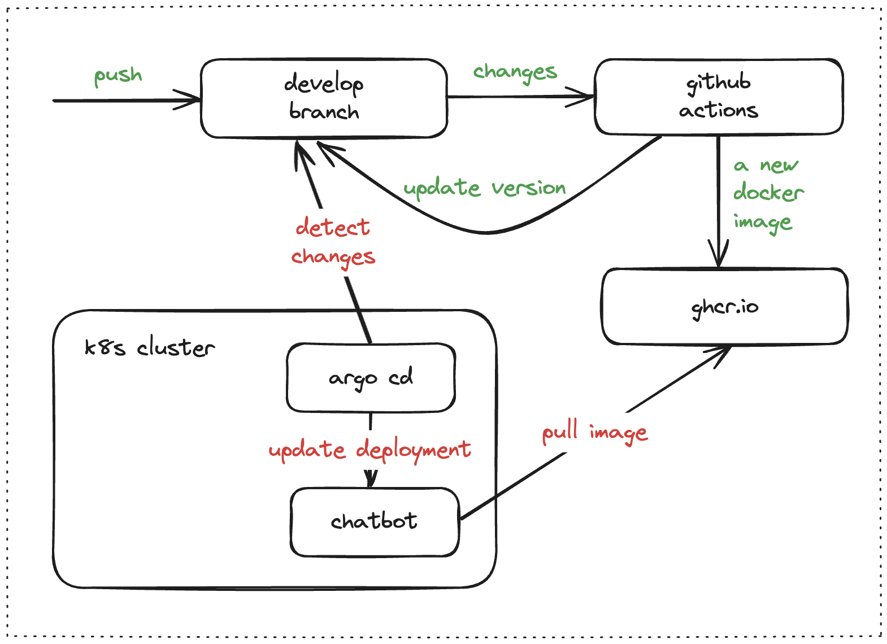

## chatbot

#### Yet Another Telegram Bot with very simple behavior 

How to build and execute it:
```
go get
go build -ldflags "-X="github.com/vlarkin/chatbot/cmd.appVersion=v1.0.0
export TELE_TOKEN="1234567890:JKwwWqp9n_SkIVN51eRKU78aB5f5O_nQuWd"
./chatbot start
```

Supported commands:
```
/start hello
/start joke
```

This bot was tested here https://t.me/RudeGnomeBot 
 

A digram for development workflow created in GitHub Actions: 
 

